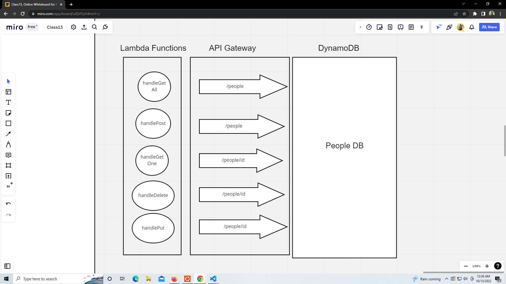

# Class 18

## serverless-api

### UML

### Root URL

[https://npjzz35lsf.execute-api.us-west-2.amazonaws.com/undefined/](https://npjzz35lsf.execute-api.us-west-2.amazonaws.com/undefined/)

### Routes

- `/people`
  - Post: Requires name and id.
  - Get All: No input
- `/people/id`
  - Delete: Requires id.
  - Put: Requires id.
  - Get One: Requires id. (Not working yet)

### Route Inputs

- Post: Requires name and id.
- Get All: No input
- Delete: Requires id.
- Put: Requires id.
- Get One: Requires id.

### Route Outputs

- Post: returns entry created.
- Get All: returns all table entries.
- Delete: returns successful delete message.
- Put: returns altered entry.
- Get One: returns entry that was searched for.
